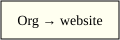

:PROPERTIES:
:ID: example-article
:END:
#+TITLE: Example article
#+HUGO_SLUG: example-article
#+HUGO_CUSTOM_FRONT_MATTER: :previous_slugs '("former-example-article")
#+AUTHOR: Example Author
#+DATE: 2026-01-01
#+DESCRIPTION: A synthetic article for publishing checks.
#+FILETAGS: :publishing:
#+HUGO_FRONT_MATTER_FORMAT: yaml

* A small example

Berlin publishes structured content.

#+CAPTION: An exported source asset.

Download the [[file:example.csv][example data]].

#+NAME: greeting
#+BEGIN_SRC rust -n -r
fn main() {
    println!("Hello, publishing!"); (ref:greeting-line)
}
#+END_SRC

See the [[(greeting-line)][greeting]].
